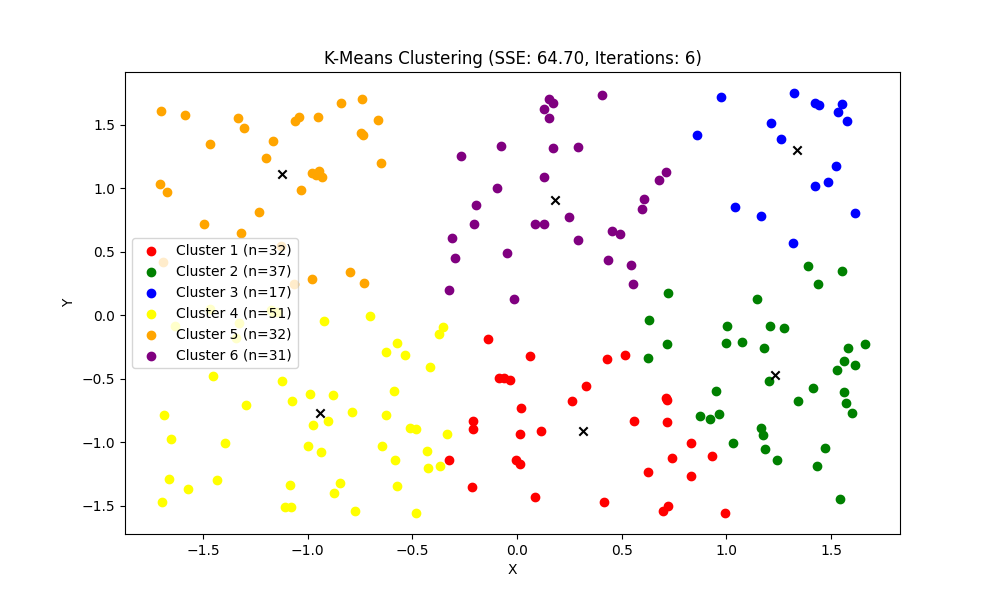
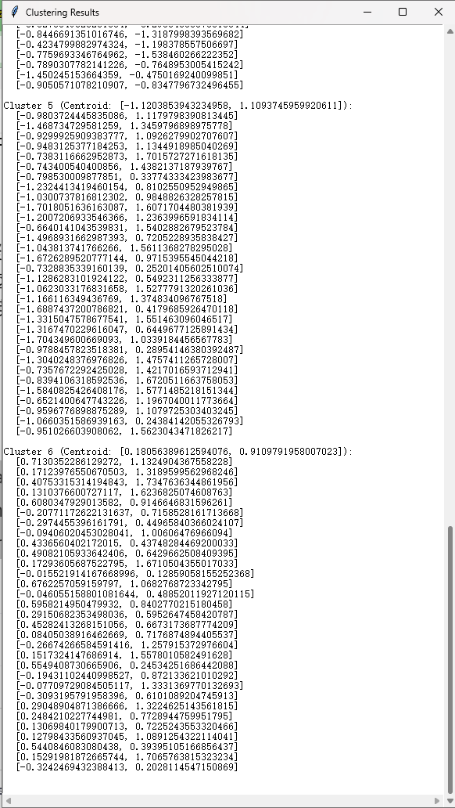

# K-Means 聚类算法实现

本项目包含一个使用Python实现的K-Means聚类算法，适用于处理二维数据集。该实现不仅包括聚类算法本身，还包括数据预处理、结果可视化以及用户交互功能。

本程序使用Python自带库进行k-means聚类算法的实现，确保与Python解释器的兼容性。为了更好地可视化聚类结果，使用matplotlib库，这是唯一的非自带库依赖。
## 作者

梁盛喜 2020020905027

## 核心特性

- 从TXT文件中加载二维数据集。
- 对数据进行标准化处理，确保一致的处理效果。
- 使用K-Means算法进行数据聚类。
- 利用Matplotlib库绘制聚类结果散点图。
- 使用Tkinter库实现图形用户界面，用于输入参数和选择文件。

## 功能优化

- 添加文件选择对话框，允许用户选择不同数据文件进行聚类分析。
- 在文件相关错误发生时（如文件未找到或格式问题），通过Tkinter的messagebox显示错误信息。
- 实施数据标准化处理，以提高聚类效果。

## 运行环境

- Python 3.11
- Matplotlib（用于数据可视化）
- Tkinter（用于图形用户界面）

确保安装了Python 3及以上版本，以及Matplotlib库。
安装Matplotlib库，可以通过运行pip install matplotlib命令完成安装。或者可以直接通过Add Interpreter进行安装。选择Settings - Project: k-means_main.py - Python Interpreter - Add Interpreter - New - （用户安装地址）\2020020905027+梁盛喜+课程设计--《Python语言程序设计》课程设计--2023-11\Final_Project\venv\Scripts\python.exe 即可使用此压缩包中自带的显示库。

## 使用说明

1. 运行`k-means_main.py`文件。
2. 在文件选择对话框中，可以选择两种类型的数据文件进行分析：
   - `test_constant.txt`：包含预定义常量数据，用于分析。
   - `test_random.txt`：由同目录下的`random_data_generator.py`脚本生成，提供随机生成的数据，用于测试。
3. 选择数据文件后，在输入对话框中输入所需的聚类数量（K值）。
4. 查看聚类结果的散点图，包括每个聚类的数据点数和SSE（误差平方和）。

**注意：** `test_random.txt`文件提供了评估K-Means算法在不同数据分布和大小下的性能的方法，允许您在不同条件下测试算法性能。

## 随机数据生成

- `random_data_generator.py`脚本用于生成`test_random.txt`文件。
- 该脚本创建随机的二维数据点，随后可以被主K-Means算法用于聚类。
- 使用此脚本，用户可以为不同的分析场景生成新的数据集，确保聚类算法的多样性和鲁棒性。

## 示例

以下是某个示例数据集的聚类结果：

  
  

# K-Means Clustering Algorithm Implementation

This project contains a Python implementation of the K-Means clustering algorithm, suitable for processing two-dimensional datasets. The implementation includes not only the clustering algorithm itself but also data preprocessing, result visualization, and user interaction features.

This program utilizes native Python libraries to implement the k-means clustering algorithm, ensuring compatibility with the Python interpreter. To better visualize the clustering results, it employs the matplotlib library, which is the only non-native library dependency.
## Author

Shengxi Liang 2020020905027

## Core Features

- Load two-dimensional datasets from TXT files.
- Standardize data for consistent processing.
- Perform data clustering using the K-Means algorithm.
- Visualize clustering results with scatter plots using the Matplotlib library.
- Implement a graphical user interface with the Tkinter library for parameter input and file selection.

## Enhanced Features

- Added a file selection dialog, allowing users to choose different data files for clustering analysis.
- Error messages are displayed using Tkinter's messagebox in case of file-related errors (like file not found or format issues).
- Implemented data standardization to improve clustering outcomes.

## Environment

- Python 3.11
- Matplotlib (for data visualization)
- Tkinter (for graphical user interface)

Ensure Python 3 or higher is installed along with the Matplotlib library.

## Usage

1. Run `main.py`.
2. In the file selection dialog, choose between two types of data files for analysis:
   - `test_constant.txt`: Contains predefined constant data for analysis.
   - `test_random.txt`: Generated by the `random_data_generator.py` script in the same directory, offering randomly generated data for testing.
3. After selecting the data file, input the desired number of clusters (K value) in the input dialog.
4. View the scatter plot of clustering results, which includes the number of data points per cluster and the SSE (Sum of Squared Errors).

**Note:** The `test_random.txt` file provides a way to assess the performance of the K-Means algorithm under different data distributions and sizes, allowing you to test the algorithm's performance under varying conditions.

## Random Data Generation

- The `random_data_generator.py` script is used to generate the `test_random.txt` file.
- It creates random two-dimensional data points, which can then be used for clustering by the main K-Means algorithm.
- Using this script, users can generate new datasets for different analysis scenarios, ensuring the versatility and robustness of the clustering algorithm.

## Example

Here is an example of clustering results for a sample dataset:

  
  